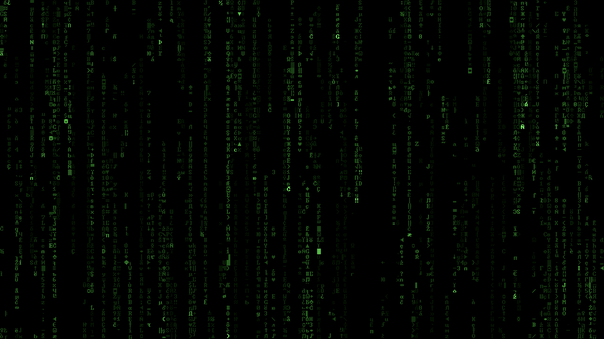

# Terminal Rain



> "Unfortunately, no one can be told what the Matrix is. You have to see it for yourself."

A super lightweight "digital rain" matrix screensaver for Windows, macOS, and Linux.
Rebuilt from the ground up using the original 1999 source code, with a single
shared simulation core built on SDL2 and a classic retro-terminal font.

I've been running the original screensaver on nearly every machine I've owned
since shortly after it was released on
[April 25, 1999](https://web.archive.org/web/20000414172541/http://www.louai.com/index.html)
by Louai Munajim.
Unfortunately, that version doesn't handle multiple monitors and has some
compatibility issues that I wanted to address. *Fortunately*, we now live in an age
where software expertise is available on demand, pretty much everywhere, from
overly chatty robots for twenty bucks a month. A couple hundred million tokens
later, I've got a version I'm pretty happy with that runs on all my different
machines. I like it a lot. Maybe you'll like it too.

## Features

- **Windows, macOS and Linux.** A native Windows screensaver, a screensaver bundle for
  macOS 26 or later, and a standalone Linux application with KDE Plasma idle integration,
  tested on Wayland.
  [Download releases](https://github.com/mccannex/terminal-rain/releases).
- **Multi-monitor support.** The screensaver covers every display, with coordinated dismissal.
- **Consistent density and HiDPI support.** Stream density scales with display area, while
  glyph sizing accounts for display scaling, including mixed-DPI setups.
- **Classic terminal font.** The original look, recreated with an embedded 8x12 font and
  480 glyphs (see [Terminal font](#terminal-font)).
- **Carefully tuned colors.** A shared green palette, with explicit sRGB tagging for macOS
  Metal output and the animated preview.
- **Native previews.** A live Windows settings preview and a macOS settings thumbnail and
  preview.
- **Self-contained, with no setup to tune.** One file or bundle per platform, with the font
  and SDL2 included. No configuration files or settings to manage.
- **Respects display sleep.** Your monitors can still turn off on schedule while the
  screensaver runs.

<details>
<summary><strong>Performance and reliability</strong></summary>

> The goal is a screensaver that costs almost nothing to leave running.

- **20 fps by design.** Matches the original animation rate and avoids rendering unnecessary
  frames. The Windows/Linux loop accounts for time spent drawing when scheduling the next frame.
- **Draw only what changes.** The screensaver maintains its image in a persistent texture,
  avoiding a full clear and redraw of its contents each frame.
- **Skip invisible work.** Off-screen glyphs and erase cells are discarded before batching
  and sorting, while visible trails continue clearing correctly.
- **Batch rendering work.** Erases are submitted together, and glyphs are grouped by color
  to reduce renderer state changes.
- **Optimized builds on every platform.** Release builds explicitly enable compiler
  optimizations on Windows, macOS and Linux.
- **Clean shutdown on rendering failures.** Failed graphics initialization, rendering errors,
  and renderer-reset notifications stop the animation rather than leaving it drawing with
  invalid resources.
- **macOS background cleanup.** Watchdogs address cases where macOS leaves a dismissed
  screensaver running invisibly. Continued typing or mouse activity no longer postpones cleanup.
- **Automated regression checks.** Tests cover rendering failures, reset delivery across
  multiple instances, preview resource cleanup, and macOS cleanup timing, with additional
  native graphics checks.
- **Embedded assets, no network access.** No runtime font loading, configuration-file reads,
  or network requests.

Measured on a 2020 MacBook Air (M1), built-in 1440x900 display:

| Metric | Value |
| --- | --- |
| CPU | 2.5 to 5% of one core |
| Memory | 44 MB, steady |
| Frame rate | 20 fps, steady |

Memory includes the whole macOS host process, about half of it GPU buffers,
and represents roughly 0.5% of the machine's 8 GB of memory.

In a controlled Windows 1080p Direct3D 11 benchmark, the optimization pass reduced CPU-side
simulation and rendering-submission time from 0.503 to 0.225 ms per tick, about 55%. This
excludes presentation and frame pacing; it is not a measurement of total application CPU
usage. See the [validation notes](docs/optimization_validation.md) for methodology and
platform coverage.

</details>

## Building

Needs CMake 3.16 or later and a C++17 compiler. CMake downloads and builds SDL2 itself.

```bash
cmake -S . -B build -DCMAKE_BUILD_TYPE=Release
cmake --build build --config Release -j
```

This builds the target for the current platform: `Terminal Rain.scr` on Windows,
`Terminal Rain.saver` on macOS (Command Line Tools are enough, no Xcode needed) or
`terminal-rain` on Linux. Platform-specific dependencies, build instructions, and
maintenance notes are available for [Windows](platform/windows/AGENT_CONTEXT.md),
[macOS](platform/macos/AGENT_CONTEXT.md), and [Linux](platform/linux/AGENT_CONTEXT.md).
The Linux notes include the required X11 and Wayland development headers.

### Tests

To build and run all regression checks available on your platform:

```bash
cmake -S . -B build -DCMAKE_BUILD_TYPE=Release -DTERMINAL_RAIN_BUILD_TESTS=ON
cmake --build build --config Release -j
ctest --test-dir build -C Release --output-on-failure
```

The tests cover zombie-cleanup timing, preview cleanup, render failures, and reset
delivery across multiple fields. Windows also runs a hidden-window accelerated-renderer
check, and macOS checks the Metal output's sRGB color space. Add `-LE native` to the
CTest command on machines without a graphics session. On a renderer
reset or rendering failure, the saver stops cleanly rather than continuing with a
lost persistent image. The release workflows run the checks that do not require a
graphics session.

## Terminal font

The original screensaver asked Windows for its built-in "Terminal" font at 12 pixels, which is
an 8x12 bitmap font. That font belongs to Microsoft, can't be redistributed, and doesn't exist
on macOS or Linux.

Terminal Rain uses George Yohng's [TerminalVector](assets/fonts/TerminalVector.ttf.LICENSE.txt)
instead, a public-domain vector redraw of the same font. At its native size it renders at
exactly 8x12 with no antialiasing, so it matches the original pixel for pixel.

[`tools/generate_glyph_atlas.py`](tools/generate_glyph_atlas.py) rasterizes 480 glyphs from it
into a [sprite sheet](assets/fonts/terminal_8x12_preview.png): the 256 classic CP437 characters
plus 224 extra Latin, Cyrillic and symbol glyphs. It then writes that sheet out as a C++ byte array
(`core/glyph_atlas_data.cpp`) that's compiled into every binary. So no platform needs the font
installed, and the screensaver uses the same glyph shapes everywhere. The script
only needs to run again if the font changes.

## Credits

- **Louai Munajim**: the original
  [Matrix Screen Saver](https://web.archive.org/web/19991205035123/http://www.louai.com/coding.html),
  a Win32/GDI program released under
  [CC BY 3.0](https://creativecommons.org/licenses/by/3.0/). The falling-code concept and the
  stream simulation (speed, trail length, column spawning) come from it.
- **OscarL**: [MatrixSS](https://github.com/OscarL/MatrixSS), an updated Windows version of
  Louai's screensaver, used as a reference throughout this project. Also pretty sure
  I used this one on my machines for a number of years without knowing it. Thanks
  for your work here!
- **George Yohng**: the public-domain TerminalVector font.
- [SDL2](https://www.libsdl.org/), under the zlib license.
- Built with help from Claude, Codex, Gemini, MetaGPT, OpenClaw, AOL Instant
  Messenger, the Wayback Machine, a lady I met at the grocery store last week,
  AskJeeves (the real one), my horoscope, the Coyote demon god, Pikachu, and with
  special thanks to viewers like you.
