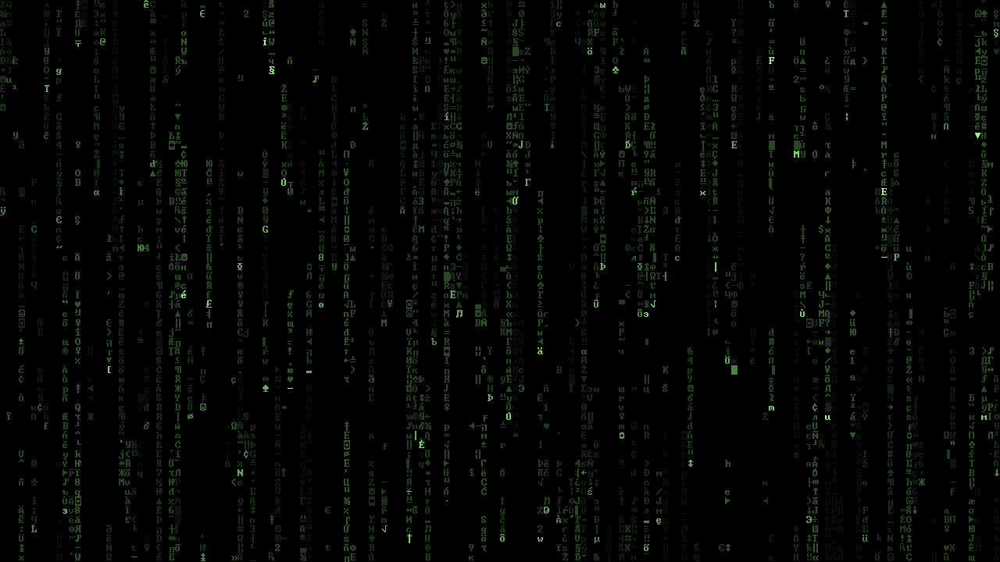

# Terminal Rain



> "Unfortunately, no one can be told what the Matrix is. You have to see it for yourself." - Morpheus, *The Matrix* (1999)

A lightweight "digital rain" screensaver for Windows, macOS and Linux. It's a full rewrite of Louai
Munajim's classic Matrix screensaver, built on SDL2 with one shared simulation core.

I've been running the original screensaver on nearly every machine I've owned since shortly after it was
released on [April 25, 1999](https://web.archive.org/web/20000414172541/http://www.louai.com/index.html).
Unfortunately, that version doesn't handle multiple monitors and has some longstanding
issues that I wanted to address. *Fortunately*, we now live in an age where software expertise is
available on demand, pretty much everywhere, from overly chatty robots for twenty bucks a month. A
couple hundred million tokens later, I've got a version I'm pretty happy with that runs on all my
different machines. I like it a lot. Maybe you'll like it too.

## Features

- **Windows, macOS and Linux.** One C++ simulation drives a Windows `.scr`, a macOS `.saver`
  bundle and a Linux binary. CI builds all three for every release.
- **Multi-monitor.** Each display gets its own instance, and they all close together.
- **Consistent density.** The stream count scales with each display's pixel area, so a laptop
  screen isn't crowded and a large monitor isn't sparse.
- **HiDPI support.** Glyphs stay the same physical size across displays with different scaling,
  including mixed-DPI setups.
- **Original font.** Uses the same 8x12 "Terminal" font as the original, with 480 glyphs
  instead of 256 (see [Terminal font](#terminal-font)).
- **Self-contained.** SDL2 is statically linked and the font is compiled in. Each platform ships
  as one file or bundle, with nothing else to install.
- **Tuned defaults, no settings.** Stream count, speed and trail length are fixed at build time.
  The Windows **Settings** button shows a short note instead of a settings dialog.
- **Screensaver integration.** The Windows `.scr` supports Install, Test and the live preview in
  the Screen Saver dialog. The macOS bundle shows a live preview and a thumbnail in System
  Settings.
- **macOS fixes.** Recent macOS can leave a dismissed screensaver running invisibly in the
  background. The macOS build has internal watchdogs that clean up after themselves: it reads
  system-wide input activity directly, so it sees you return even when macOS stops sending it
  events, and shuts down about 2 seconds later. A 4-hour time limit backs that up. It also
  never stops macOS from starting the screensaver.

## Performance

The goal is a screensaver that costs almost nothing to leave running.

- **Fixed 20 fps.** Frames run on a 50 ms timer, the same rate as the original. The loop
  subtracts each frame's own work time, so the pace holds steady under load.
- **Minimal drawing.** The screen texture is never cleared. Each frame, every stream draws 2
  glyphs and erases 4 cells, and nothing else changes.
- **Batched rendering.** Each frame's erases go out as one draw call. Glyph draws are sorted by
  color, so the GPU color changes only about 12 times per frame.
- **Scaled workload.** 3,000 streams at 1920x1080, scaled by screen area (1,875 at 1440x900),
  with a floor of 24 for small previews.
- **No runtime I/O.** No config files, no font loading from disk, no network access.

Measured on a 2020 MacBook Air (M1), built-in 1440x900 display:

| Metric | Value |
| --- | --- |
| CPU | 2.5 to 5% of one core |
| Memory | 0.5% of 8 GB (44 MB, steady; whole macOS host process, about half is GPU buffers) |
| Frame rate | 20 fps, steady |

Release file sizes (v1.0.4): Windows `.scr` about 1.9 MB, macOS bundle about 0.7 MB zipped
(Apple Silicon only in that release), Linux binary about 4 MB.

## Platforms

- **Windows**: download `Terminal Rain.scr`, right-click it and choose **Install**.
- **macOS 26 or later**: install with the `curl` command in the
  [release notes](.github/RELEASE_NOTES.md). The bundle isn't notarized by Apple, so a
  browser download gets blocked by Gatekeeper. Release builds are universal, but the Intel
  build is untested on real hardware. Details: [`platform/macos/AGENT_CONTEXT.md`](platform/macos/AGENT_CONTEXT.md).
- **Linux (KDE Plasma)**: a standalone `terminal-rain` binary, started by KDE's Power
  Management "run script" idle action. Tested on Wayland. Details:
  [`platform/linux/AGENT_CONTEXT.md`](platform/linux/AGENT_CONTEXT.md).

On Windows and Linux, the screensaver currently exits on mouse movement only.

## Building

Needs CMake 3.16 or later and a C++17 compiler. CMake downloads and builds SDL2 itself.

```bash
cmake -S . -B build -DCMAKE_BUILD_TYPE=Release
cmake --build build -j
```

This builds the target for the current platform: `Terminal Rain.scr` on Windows,
`Terminal Rain.saver` on macOS (Command Line Tools are enough, no Xcode needed) or
`terminal-rain` on Linux. Linux also needs the X11 and Wayland development headers listed in
[`platform/linux/AGENT_CONTEXT.md`](platform/linux/AGENT_CONTEXT.md).

## Terminal font

The original screensaver asked Windows for its built-in "Terminal" font at 12 pixels, which is
an 8x12 bitmap font. That font belongs to Microsoft, can't be redistributed, and doesn't exist
on macOS or Linux.

Terminal Rain uses George Yohng's [TerminalVector](assets/fonts/TerminalVector.ttf.LICENSE.txt)
instead, a public-domain vector redraw of the same font. At its native size it renders at
exactly 8x12 with no antialiasing, so it matches the original pixel for pixel.

[`tools/generate_glyph_atlas.py`](tools/generate_glyph_atlas.py) rasterizes 480 glyphs from it
into a [sprite sheet](assets/fonts/terminal_8x12_preview.png): the 256 classic CP437 characters
plus 224 extra Latin, Cyrillic and symbol glyphs. It then writes that sheet out as a C++ byte array
(`core/glyph_atlas_data.cpp`) that's compiled into every binary. So no platform needs the font
installed, and the rain looks identical everywhere. The script only needs to run again if the
font changes.

## Credits

- **Louai Munajim**: the original [Matrix Screen Saver](https://web.archive.org/web/19991205035123/http://www.louai.com/coding.html),
  a Win32/GDI program released under
  [CC BY 3.0](https://creativecommons.org/licenses/by/3.0/). The falling-code concept and the
  stream simulation (speed, trail length, column spawning) come from it.
- **OscarL**: [MatrixSS](https://github.com/OscarL/MatrixSS), an updated Windows version of
  Louai's screensaver, used as a reference throughout this project. Also pretty sure I used this one on my machines for a number of years without knowing it. Thanks for your work here!
- **George Yohng**: the public-domain TerminalVector font.
- [SDL2](https://www.libsdl.org/), under the zlib license.
- Built with help from Claude, Codex, Gemini, MetaGPT, OpenClaw, AOL Instant Messenger, the Wayback Machine, a lady I met at the grocery store last week, AskJeeves (the real one), my horoscope, the Coyote demon god, Pikachu, and with special thanks to viewers like you.
